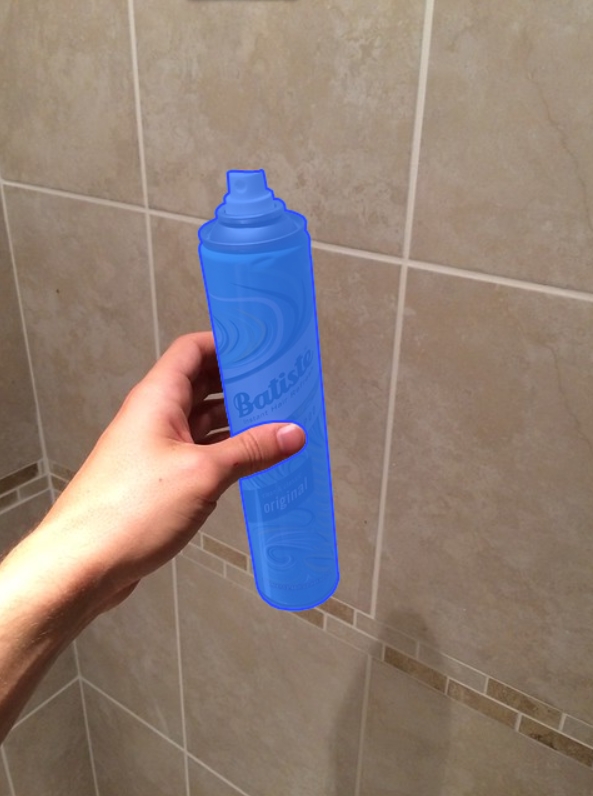
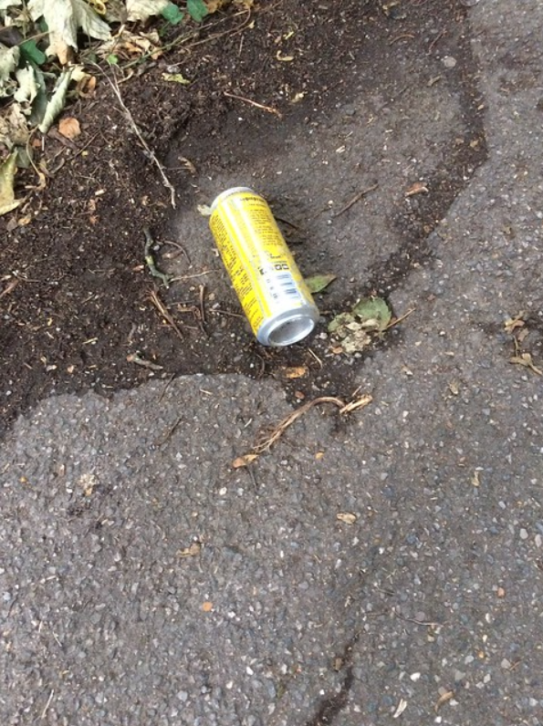
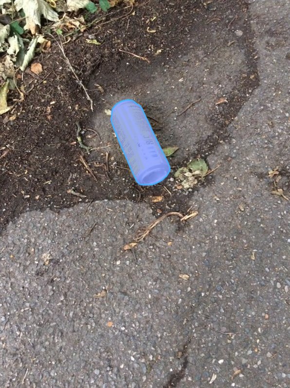

# Prompt 2 – Few-Shot Example (Image-Based)

This prompt demonstrates how the AI agent can use several known (X, y) image pairs as examples before generating a prediction for a new image.

The annotated images in `/data/annotated/` contain the ground-truth labels (y) created during Lab 1.2.

---

## User Prompt

You are an AI agent performing end-to-end visual inference on small datasets.  
Below are several known examples consisting of input images **X** and their corresponding annotated labels **y**.

### Known (X, y) Examples from Lab 1.2

1. **X:** `/data/img_1.png`

    

   **y:** `/data/img_1_annotated.png`

   

2. **X:** `/data/img_2.png`

    

   **y:** `/data/img_2_annotated.png`

    

3. **X:** `/data/img_3.png`

    

   **y:** `/data/img_3_annotated.png`

    

Use the patterns in these examples (visual features, annotation style, object classes, segmentation masks, etc.) to infer the correct output for a new image.

---

### New Input Image (X)

    

`/data/img_4.png`

### Task

Analyze the known examples (X, y), learn the relationship, then:

**Predict the output y for the new image `/data/img_4.png`.**  
Return the expected annotation or label **in the same format as the Lab 1.2 examples**.
